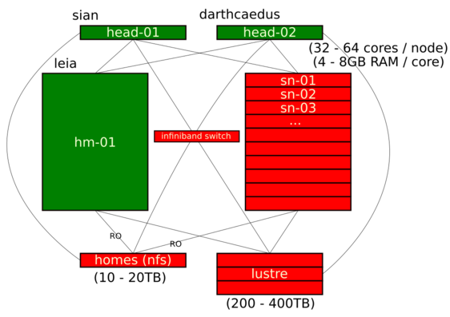

# Using the CNIO HPC cluster

These are some guidelines to using our HPC cluster and the Slurm workflow system.

!!! Note

    This section of the docs is under construction. There's lots of information missing, which will be added shortly.
    In the meantime, [see here](https://hpc-carpentry.github.io/hpc-intro/) for an introduction to HPC and Slurm.

## The first rule

The first rule of the cluster is: you use the queueing system. **Commands should NOT be executed directly against the login nodes**.

## Cluster resources

## Submitting jobs

The command structure to send a job to the queue is the following:

    sbatch -o <logfile> -e <errfile> -J <jobname> -c <ncores> --mem=<total_memory>G \
        -t<time_minutes> --wrap "<command>"

For example, to submit the command `bwa index mygenome.fasta` as a job: 

    sbatch -o log.txt -e error.txt -J index_genome -c 1 --mem=4G -t120 \
        --wrap "bwa index mygenome.fasta"

### Job resources

`-c`, `--mem`, and `-t` tell the system how many cores, RAM memory, and time your job will need.

There is a limit of 24 hours per job. As a general rule, you should try to break down your job if it takes longer than ~8 hours.

#### Resources and job priority

The resources you request for a job will influence the chances that such job has to enter the queue, compared to others:
the more resources you request, the longer you may have to wait for those resources to be available.

In addition, the future priority of your jobs will also be influenced by the resources you *request* (not *use*, *request*, even if you don't use them in the end).
The more you request, the less priority you'll have for future jobs.

## Installing software

Software management is left up to the user (at least for now), and we recommend doing it with [conda](https://docs.conda.io/en/latest/miniconda.html), by taking advantage of the [bioconda](http://bioconda.github.io/) repository.
